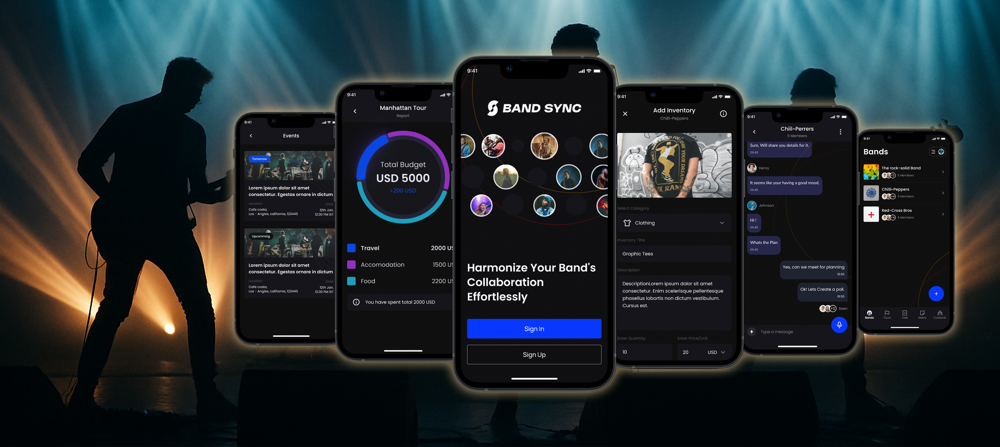
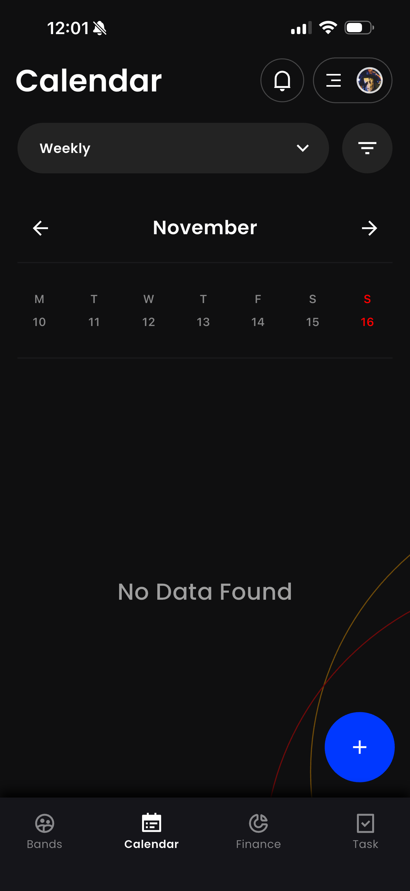
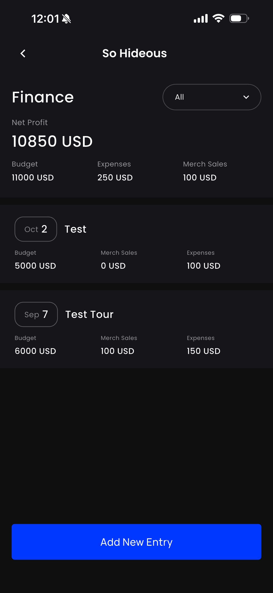
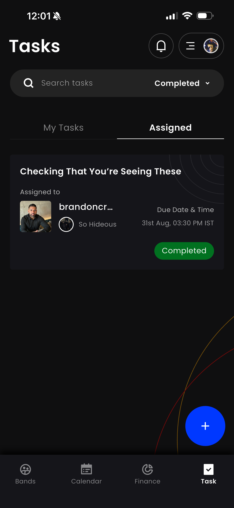
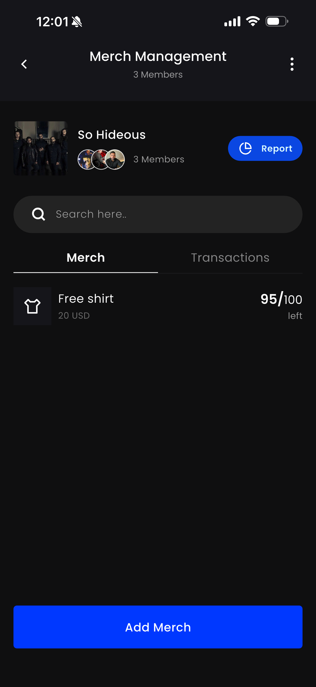
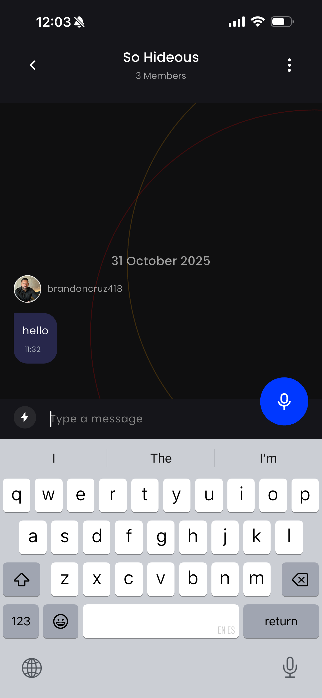
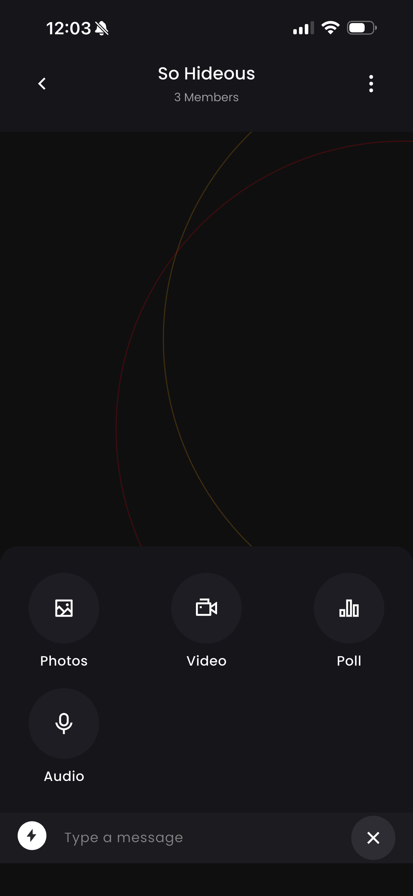
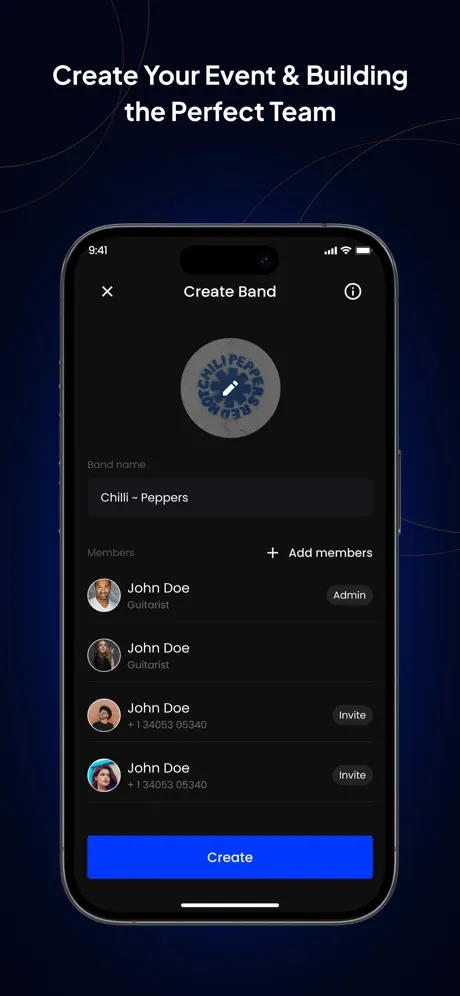

# BandSyncApp-Showcase

BandSync is an app for bands and musicians to manage tours, money, merch, tasks, and communication in one place.

## What BandSync Does
- Organizes shows and tours
- Tracks income and expenses
- Manages merch inventory
- Helps bands assign tasks
- Central chat for the band

## Tech Stack
- **Mobile app built with:** Flutter, Dart, Swift (iOS modules), Java (Android modules), C++/CMake (plugin integrations), XMPP (real-time chat)
- **Backend / services:** AWS (Lambda, API Gateway, DynamoDB, S3, Cognito)

## My Role
- Founder and product lead
- Defined product vision and roadmap
- Led UX and feature design
- Managed development and QA
- Drove launch and user feedback

## Screenshots

### In-app Screens

  
  
  

  
  
  
  

### Store Artwork

  
  
  

## Links
- **Website:** https://bandsyncapp.com/
- **App Store:** https://apps.apple.com/us/app/bandsync-band-organizer/id6557050547
- **Demo video:** 
